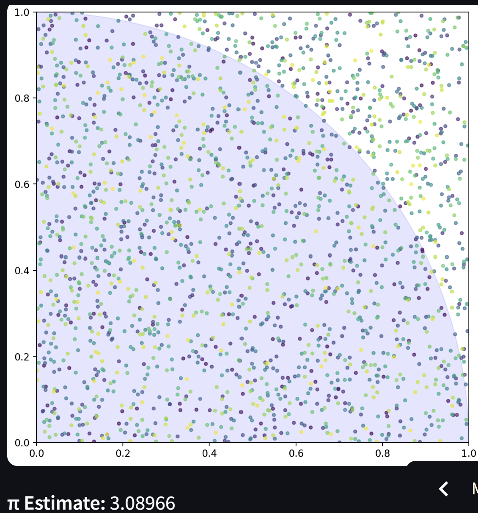

# Streamlit Statistical Demonstrations

**Link to [App](https://blank-app-pctuuyjof7r.streamlit.app/)**

A collection of interactive, educational visualizations for core statistical concepts built with [Streamlit](https://streamlit.io/). Ideal for students, educators, and data enthusiasts looking to deepen their understanding through simulation and visual exploration.

## Included Demonstrations

### 1. **Confidence Interval Visualizer**
Visualize the behavior of 95% confidence intervals for binary proportions using the normal approximation.

- Each sample's confidence interval is displayed.
- Green lines show intervals that contain the true proportion.
- Red lines show intervals that miss the true proportion.
- Intuition: ~95% of intervals should contain the true value.

### 2. **Monte Carlo π Simulator**
Estimate the value of π using a simple Monte Carlo method.

- Randomly sample points inside a unit square.
- Count how many fall inside the quarter-circle.
- Estimate π as `4 × (inside / total points)` in real-time.

### 3. **Central Limit Theorem Demo**
Demonstrate how sample means approach a normal distribution, even when the population is not normally distributed.

- Choose population distributions: Exponential, Uniform, Binomial, Poisson.
- Adjust sample size and number of samples.
- Visualize both population and sampling distribution with a normal curve overlay.

---

## Getting Started

### Prerequisites

Make sure you have Python 3.7+ installed. Then install dependencies:

```bash
pip install streamlit numpy matplotlib scipy statsmodels
```

### Run the App

```bash
streamlit run app.py
```

---

## Screenshots

| Confidence Intervals | Monte Carlo π | Central Limit Theorem |
|----------------------|----------------|-------------------------|
|  |  |  |
---

## Educational Value

This app is great for:
- Introductory stats courses
- Live lectures or workshops
- Interactive learning via self-paced exploration
- Demonstrating core statistical ideas without complex math
---

## Acknowledgments

Built using:
- [Streamlit](https://streamlit.io/)
- [Matplotlib](https://matplotlib.org/)
- [SciPy](https://www.scipy.org/)
- [Statsmodels](https://www.statsmodels.org/)

### Readme created with chatgpt
